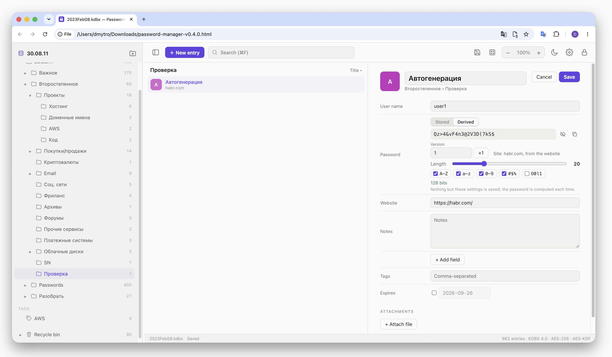

# html-password-manager

A password manager for KeePass databases (`.kdbx`) — in the spirit of KeeWeb, but entirely
contained in one standalone HTML file. No network is used: the database is decrypted inside
the page and saved straight back to disk.



## How to use

1. Build `build/password-manager.html` (see "[Build](#build)") and open it in a browser —
   straight from disk is fine.
2. "Open file" → pick a `.kdbx` database, or drag it into the window.
3. Enter the master password (and pick the key file, if the database has one) → Unlock.

In Chrome, Edge and Arc the file is opened through the File System Access API: changes are
written back into the same file, a moment after each edit if autosave is on, and the file
is offered again on the next visit — only its handle is remembered, never its contents or
the password. In Safari and Firefox the file opens read-only, and Save downloads an updated
copy of the database.

"New database" creates an empty KDBX 4 database encrypted with AES-256 and Argon2id
(64 MiB, 10 passes — KeePassXC's defaults, about half a second in a browser).

## Security

- **Nothing leaves the page.** A Content-Security-Policy in the file forbids every network
  request, form submission and outside resource; the build fails if the policy or an
  external reference goes missing.
- The format code is [kdbxweb](https://github.com/keeweb/kdbxweb), the library KeeWeb is
  built on; Argon2 is [hash-wasm](https://github.com/Daninet/hash-wasm)'s WebAssembly, which
  is embedded in the file too.
- Protected fields are kept XOR-masked in memory (kdbxweb's `ProtectedValue`) and are
  masked on screen until revealed. Search never looks into protected fields.
- **Passwords in any language.** When a browser takes a field for a password, macOS switches
  on Secure Input and forces a Latin keyboard layout, so a Cyrillic master password cannot
  be typed. Chrome takes for a password not only `type=password` but, by heuristics, any
  field styled with `-webkit-text-security` or holding a value of dots — and keeps doing so
  once it has. Secret fields here give no such hint: they are plain text inputs with
  transparent text, and a layer of dots is drawn over them (in a monospace font, so the
  caret stays in place). A badge shows whether the hidden text is being typed in Cyrillic
  (РУС) or Latin (ENG). The trade-off: Secure Input, which also hides keystrokes from other
  apps, is never engaged.
- A copied secret is wiped from the clipboard after 30 seconds and on lock.
- The database locks after 15 idle minutes, and on `⌘L`. Locking drops the decrypted
  database from memory; a lock with unsaved changes that cannot be written waits instead of
  throwing the changes away.
- Links in entries open only for `http`, `https`, `ftp` and `mailto`, with `noopener`.
- Passwords are generated with `crypto.getRandomValues` and rejection sampling: every
  character is equally likely.

## Features

- **Groups**: a collapsible tree, creating, renaming, deleting through the context menu,
  moving by drag and drop (entries and groups), resizable and hideable panel (`⌘\`).
- **Entries**: title, user name, password, website, notes, custom fields (plain or
  protected), tags, expiry date, attachments. Sorting by title, user name, website, dates.
- **One-time codes** (TOTP): from an `otp` field (`otpauth://` URL or a bare secret, as
  KeePassXC and KeeWeb store it), from KeePass's `TimeOtp-*` fields, or from TrayTOTP's
  `TOTP Seed`. SHA-1, SHA-256, SHA-512; the code refreshes with a countdown.
- **Editing** works on a draft: Save stores the previous state in the entry's history first,
  as KeePass does; Cancel drops the draft. Earlier versions can be browsed and restored.
- **Recycle bin**: deleting moves to the bin; from there — restore or delete for good.
- **Search** across title, user name, website, notes, tags, custom fields and attachment
  names; every word of the query must match.
- **Password generator**: length, character sets, look-alike characters, entropy estimate.
  Strength meter for typed passwords.
- **Derived passwords**: instead of a stored password, an entry can keep only the rules for
  computing it from the master password, the site, the user name and a version — see
  "[Derived passwords](#derived-passwords)".
- **Database**: rename, change the master password and key file, save a copy.
- **Languages**: English, 中文, हिन्दी, Español, Français, العربية, বাংলা, Português, Русский,
  اردو — the ten most spoken. Chosen in Settings, or taken from the browser; Arabic and Urdu
  lay the window out right to left.
- **Theme**: system, light, dark. **Zoom**: 50–200 %. Language, theme, zoom, panel widths,
  sorting, generator options and collapsed groups are remembered.

## Derived passwords

In edit mode the password is either **Stored** (an ordinary password kept in the file) or
**Derived**: computed each time from

- the master password of the database (the key file, if any, is left out),
- the site — the domain of the entry's website (`https://www.github.com/login` → `github.com`),
- the user name of the entry,
- the version — 1, 2, … up to 2³² − 1; "+1" gives the same account a new password.

Those four make 32 bytes of entropy. The requirements — length, character sets, look-alikes —
only shape those bytes into characters: changing them does not change the entropy. So a lost
database costs nothing: the same master password, site, user name and version give the same
password on any machine. To recover one, create a new database with the same master password
and a derived entry with the same website, user name and version. The defaults are 20
characters, all four character sets, no look-alikes; entries with other requirements need
those requirements remembered as well.

The site and the user name are the entry's own fields, not copies: editing the website to
another domain makes another password, and the editor shows the new one at once. The
scheme, path, port and a leading `www.` do not matter; a subdomain does — `login.github.com`
and `github.com` are two sites. A website that is not a URL ("My bank") is used as it is.

**Storage and compatibility.** The file format does not change. The password field of the
entry holds a JSON object instead of a password, marked with a fixed GUID:

```json
{"$derived":"6f1c2b9e-4a7d-4e38-9b51-2d0c8a73f5e4","gen":3,"ver":1,
 "len":20,"upper":true,"lower":true,"digits":true,"symbols":true,"ambiguous":false,"check":"c0014f12"}
```

Other KeePass apps open the database as usual, but show that JSON as the password. `check`
is a short fingerprint of the entropy the password was saved with: when the master password,
the website or the user name changed since, the entry says it is a different password now,
and saving it again accepts the new one.

**Changing the master password** changes every derived password. The dialog counts the
entries that have one and offers (on by default) to turn them into stored passwords first:
they keep their values, but can no longer be recovered without the file. Left derived, each
becomes a new password, and the old values can be computed only from the old master password.

### The algorithm: generator 3

Everything below is frozen: changing any constant would change every derived password
already in use. A future generator would get a new number (`"gen"` in the JSON) and leave
this one as it is. The code is `src/derived.ts`; `npm test` checks it against fixed vectors
and against an independent implementation written from this description with Node's own
`crypto`. The primitives are standard — SHA-256, HMAC-SHA-256, Argon2id — so the algorithm
can be rebuilt in any language.

It runs in two stages: the secrets become 32 bytes of entropy, then the requirements carve
characters out of those bytes.

**Stage 1 — entropy.**

1. *Normalize the inputs.* All strings are UTF-8.
   - `site` — the host of the entry's website, parsed as a WHATWG URL (`https://` is put in
     front when the text has no `scheme://`): lower case, IDN in punycode, no port, no user
     name or password, a leading `www.` dropped. A website that does not parse as a URL is
     used as it is. Then trimmed, NFC-normalized, lower-cased.
   - `user` — the user name, trimmed and NFC-normalized; case is kept.
   - `master` — the master password, NFC-normalized, nothing trimmed. An "é" typed as one
     character or as "e" plus a combining accent gives the same password.
2. *Salt.*
   ```
   salt = SHA-256( "html-password-manager/derived/v3" ‖ 0x00
                   ‖ u32be(byte length of site) ‖ site
                   ‖ u32be(byte length of user) ‖ user
                   ‖ u32be(version) )
   ```
   The length prefixes keep `ab` + `c` and `a` + `bc` apart; the label keeps these bytes
   apart from any other use of the same inputs. `u32be` is a 4-byte big-endian integer.
3. *Stretch.*
   ```
   entropy = Argon2id(password = master, salt, memory = 64 MiB, passes = 3,
                      lanes = 1, version 0x13, output = 32 bytes)
   ```
   Argon2id makes every guess of the master password cost 64 MiB of memory, which is what
   slows down GPUs and ASICs. Since the site, user name and version are in the salt, every
   account has its own: no table can be computed in advance, and each account has to be
   attacked on its own.

**Stage 2 — shaping.** The requirements are used only here, so they change how the
password looks, not the entropy behind it.

4. *A stream of random bytes*, as long as needed — 32 bytes are not enough for a long
   password and its shuffle:
   ```
   block(i) = HMAC-SHA-256(key = entropy, "hpm-v3-stream" ‖ u32be(i)),  i = 0, 1, 2, …
   ```
5. *An unbiased number below n.* Take the next 4 bytes of the stream as a big-endian u32
   `x`. If `x ≥ 2³² − (2³² mod n)`, drop it and take the next; otherwise the result is
   `x mod n`. (A bare `x mod n` would favour the start of the alphabet.)
6. *Characters.* The sets, in this order, each only if chosen:
   ```
   A–Z      ABCDEFGHIJKLMNOPQRSTUVWXYZ
   a–z      abcdefghijklmnopqrstuvwxyz
   0–9      0123456789
   symbols  !#$%&*+-=?@^_~.,:;()[]{}<>/|
   ```
   Without look-alikes, `O 0 o I l 1 |` are removed from them. Then:
   ```
   chars = []
   for each chosen set:            chars.push(set[draw(|set|)])      # every set is present
   while |chars| < length:         chars.push(all[draw(|all|)])      # all = the sets joined
   for i = length − 1 down to 1:   j = draw(i + 1); swap chars[i], chars[j]   # Fisher–Yates
   password = chars joined
   ```
   Length is 4 to 128. Taking one character from every set first is what makes "has a
   digit" and "has a symbol" guaranteed; the shuffle hides where those characters went.
7. *Check.* `check = hex(HMAC-SHA-256(key = entropy, "hpm-v3-check")[0..4])` — 8 hex
   digits saved in the JSON. It shows that the inputs changed; it is not the password and
   gives nothing of it away.

**Test vector.** Master password `Тестовый пароль`, website `https://www.github.com/login`
(site `github.com`), user name `me@example.com`, version 1, the default requirements
(20 characters, all four sets, no look-alikes):

```
password  A6qVXXF]7<%a)aa<x7*U
check     c0014f12
```

The same entropy with 12 characters and no symbols gives `yaM6VJaJFYUQ` (the check stays
`c0014f12`); version 2 with the defaults gives `3q_bwppbE8P2+ufKr:P6`.

### How strong it is

- A derived password has at most 256 bits of entropy (the 32 bytes); 20 characters from all
  four sets without look-alikes is about 128 bits. In practice the ceiling is the master
  password.
- **The weak point of any derived-password scheme:** a password leaked by one site lets an
  attacker guess the master password offline, since the site and user name are known. Each
  guess costs one Argon2id run over 64 MiB — around 0.15–0.4 s in a browser, less on
  dedicated hardware. A short or common master password will be found; a long passphrase
  will not. Stored passwords do not have this weakness, which is why both kinds exist.
- As long as the master password holds, a leaked password reveals nothing about the other
  sites or versions: they come from other salts, so from other Argon2 runs.

The master password is kept XOR-masked in memory while the database is open, along with the
entropy and passwords computed so far; locking drops them all.

## Keyboard shortcuts

| Action | Keys |
| --- | --- |
| Save | `⌘S` |
| Lock | `⌘L` |
| Search | `⌘F` |
| New entry | `⌘N` |
| Edit · save the edit | `⌘E` or `Enter` · `⌘Enter` |
| Cancel the edit | `Esc` |
| Password generator | `⌘G` |
| Copy password · user name · website | `⌘C` · `⌘B` · `⌘U` |
| Previous · next entry | `↑` · `↓` |
| Delete the entry | `⌫` |
| Group panel | `⌘\` |
| Zoom | `⌘+` · `⌘−` · `⌘0` |

## Translations

The English text stays in the code: `t('menu', 'Delete')`, `tn('status', '{count} entry',
'{count} entries', n)`, and `data-i18n="context"` / `data-i18n-attr="context"` in the
template. The first argument is the context — the part of the interface a string belongs
to, so the same English word can be translated differently in two places. A dictionary,
`src/locales/<code>.json`, maps context → English text → translation:

```json
{
  "menu": { "Delete": "Удалить" },
  "status": { "{count} entries": { "one": "{count} запись", "few": "{count} записи", "many": "{count} записей", "other": "{count} записи" } }
}
```

A string the dictionary lacks is shown in English. A text with a number has one form per
plural category of the language (`Intl.PluralRules`), keyed by the English plural form.
`npm run i18n` lists, per language, the strings not translated yet and the ones no longer
used; `npm test` checks that every translation keeps the English placeholders and has all
plural forms.

## Build

```sh
./build.sh         # installs the dependencies if needed, then builds build/password-manager.html
npm install
npm run build      # -> build/password-manager.html
npm run watch      # rebuild on changes in src/
npm run typecheck  # tsc --noEmit
npm test           # opening, editing and saving .kdbx files, the generator, TOTP, derived passwords, the dictionaries
npm run test:browser  # the built page in headless Chrome
npm run i18n       # strings each dictionary lacks or no longer needs
```

`build.mjs` bundles `src/main.ts` with esbuild into an IIFE and substitutes it, along with
the styles and the icon (a data URI), into `src/template.html`. kdbxweb's fallbacks for
Node (`crypto`, `@xmldom/xmldom`) are replaced with empty stubs — a browser has `crypto.subtle`
and `DOMParser`. The result is `build/password-manager.html`, around 400 KB, a quarter of it the dictionaries.

`tools/fixtures/Database.kdbx` is a sample database for the tests; its password is `Тестовый пароль`.

## Layout

```
src/template.html   markup with the __STYLES__/__APP__/__ICON__ placeholders, the CSP
src/styles.css      palette, light and dark themes, three panes
src/main.ts         the gate, unlocking, saving, locking, toolbar, shortcuts, settings
src/kdbx.ts         kdbxweb + Argon2: open, save, create; fields, groups, recycle bin
src/files.ts        File System Access API, drag-and-drop, file input; recent files
src/groups.ts       the group tree, tags and recycle bin in the left panel
src/list.ts         the entry list
src/details.ts      one entry: reading, editing on a draft, history, attachments, TOTP
src/search.ts       search, sorting, safe links
src/generator.ts    password generator and strength estimate
src/derived.ts      derived passwords: generator 3, the site of a website, the stored JSON, the session's master password
src/genpanel.ts     the generator popover
src/otp.ts          TOTP (RFC 6238) and the ways secrets are stored
src/clipboard.ts    copying with a timed wipe
src/avatar.ts       entry icons: custom icons from the database or a coloured letter
src/settings.ts     localStorage: language, theme, zoom, panels, lock and clipboard timers
src/i18n.ts         t()/tn(), the language list, translating the page's markup
src/locales/        one dictionary per language
src/ui.ts           dialogs, context menu, popovers, toasts, icons
tools/              tests: .kdbx round trips, generator and TOTP, derived passwords, dictionaries, the page in headless Chrome
vendor/icon.svg     the icon
docs/               working notes (not under git)
build/              the build output
```

## Limitations

- KDBX 3.1 and 4.x are supported; Twofish-encrypted and KeePass 1 (`.kdb`) files are not.
- No sync, browser extension, auto-type or merging of changed copies.
- Only Chromium-based browsers can write the file in place.

## License

MIT — see [LICENSE](LICENSE). kdbxweb and hash-wasm are MIT-licensed as well.
