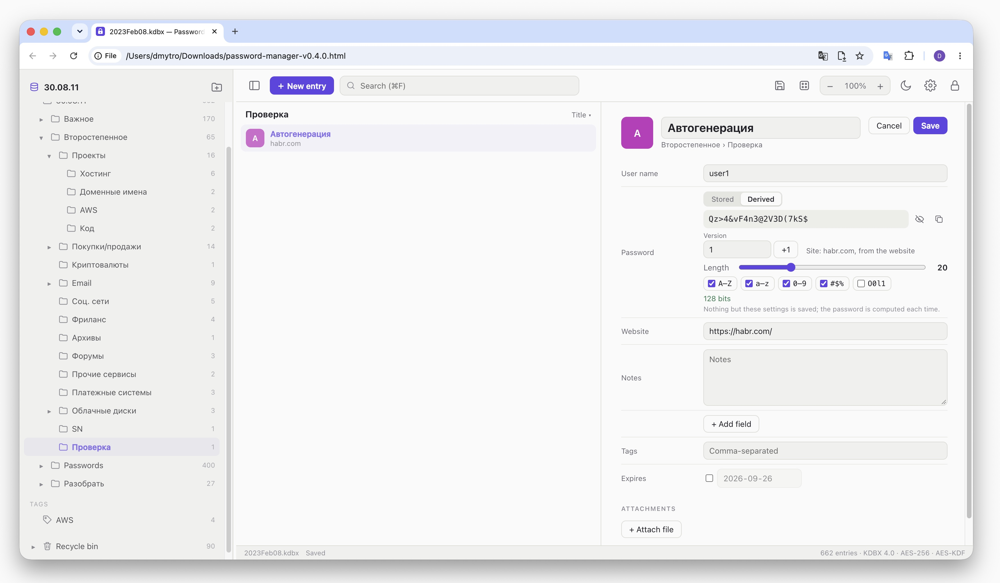

# html-password-manager

<!-- languages -->
<h3 align="center">
<a href="../../README.md">🇬🇧 English</a> ·
<a href="README.zh.md">🇨🇳 中文</a> ·
<a href="README.hi.md">🇮🇳 हिन्दी</a> ·
<a href="README.es.md">🇪🇸 Español</a> ·
<a href="README.fr.md">🇫🇷 Français</a> ·
<a href="README.ar.md">🇸🇦 العربية</a> ·
<a href="README.bn.md">🇧🇩 বাংলা</a> ·
<a href="README.pt.md">🇧🇷 Português</a> ·
<a href="README.ru.md">🇷🇺 Русский</a> ·
<a href="README.ur.md">🇵🇰 اردو</a> ·
<a href="README.id.md">🇮🇩 Bahasa Indonesia</a> ·
<a href="README.de.md">🇩🇪 Deutsch</a> ·
<a href="README.ja.md">🇯🇵 日本語</a> ·
<a href="README.mr.md">🇮🇳 मराठी</a> ·
<a href="README.te.md">🇮🇳 తెలుగు</a> ·
<b>🇹🇷 Türkçe</b> ·
<a href="README.uk.md">🇺🇦 Українська</a>
</h3>
<!-- /languages -->

**Deterministic Password** parolaları yalnızca saklamakla kalmaz, onları hesaplar. Bir sitenin
parolası ana parolanızdan, siteden, kullanıcı adınızdan ve bir sürüm numarasından Argon2id ve
HMAC-SHA-256 ile türetilir. Veritabanı dosyası kaybolursa aynı veriler, hangi bilgisayarda
olursa olsun aynı parolaları yeniden verir — dosyayı kaybetmek artık korkutucu değil. Bir
sitenin parolasını değiştirmek için sürümü yükseltin. Nasıl çalıştığı:
"[Türetilmiş parolalar](#türetilmiş-parolalar)".

Aynı zamanda tam teşekküllü bir KeePass parola yöneticisidir: sıradan `.kdbx` dosyalarını
(KDBX 4, AES-256, Argon2id) açar, düzenler ve kaydeder; böylece aynı veritabanı KeePassXC,
KeePass ya da KeeWeb'de çalışmaya devam eder. Türetilmiş bir parola girdide diğer parolalar
gibi saklanır ve diğer KeePass uygulamaları onu aynı şekilde gösterir.

Her şey çevrimdışı çalışır: hesap yok, bulut yok, ağ isteği yok. Uygulamanın tamamı tek başına
çalışan tek bir HTML dosyasıdır; veritabanının şifresi sayfanın belleğinde çözülür ve doğrudan
diske geri kaydedilir, ana parola ise sayfadan hiç çıkmaz. Aynı sayfa aynı zamanda, yanındaki
sekmede giriş bilgilerini dolduran bir [Chrome uzantısıdır](#chrome-uzantısı) —
**[Chrome Web Mağazası'ndan yükleyin](https://chromewebstore.google.com/detail/hiahfdknjchamepclnokcalkcjcfhahf)**.

**[Çevrimiçi sürüm](https://marketkernel.github.io/html-password-manager/)** — aynı sayfanın
PWA (Progressive Web App) hâli: sisteme yüklenebilir, ardından kendi penceresi ve simgesiyle
ayrı bir uygulama olarak çalışır ve çevrimdışı da işler. Bilgisayarda Chrome, Edge ve Arc'ta
adres çubuğundaki yükleme düğmesini kullanın; Android'de Chrome'un ⋮ menüsü → Uygulamayı yükle;
iOS'ta Safari'de ya da Chrome'da Paylaş → Ana Ekrana Ekle. Orada da veritabanı sizin diskinizde
kalır — bkz. "[GitHub Pages](#github-pages)".



## Kullanım

1. `build/password-manager.html` dosyasını derleyin (bkz. "[Derleme](#derleme)") ve bir
   tarayıcıda açın — doğrudan diskten açmak da olur.
2. "Dosya aç" → bir `.kdbx` veritabanı seçin ya da onu pencereye sürükleyin.
3. Ana parolayı girin (veritabanının bir anahtar dosyası varsa onu da seçin) → Kilidi aç.

Chrome, Edge ve Arc'ta dosya File System Access API üzerinden açılır: değişiklikler aynı
dosyaya geri yazılır — otomatik kaydetme açıksa her düzenlemeden bir an sonra — ve dosya bir
sonraki ziyarette yeniden önerilir; hatırlanan yalnızca dosyanın tanıtıcısıdır (handle), asla
içeriği ya da parola değil. Safari ve Firefox'ta dosya salt okunur açılır ve "Kaydet",
veritabanının güncellenmiş bir kopyasını indirir — telefonlarda da böyledir: Android'deki
Chrome'da File System Access yoktur, iOS'taki her tarayıcı ise, Chrome da dahil, Safari'nin
motoruyla çalışır. iOS'ta "Kaydet" kopyayı bunun yerine paylaşma menüsüne gönderir — bkz.
"[Telefonda](#telefonda)".

"Yeni veritabanı", AES-256 ve Argon2id ile şifrelenmiş boş bir KDBX 4 veritabanı oluşturur
(64 MiB, 10 geçiş — KeePassXC'nin varsayılanları; bir tarayıcıda yaklaşık yarım saniye).

### Telefonda

900 piksel genişliğe kadar — bir telefonda ya da dik tutulan bir tablette — sayfa aynı anda tek
bir şey gösterir. Girdi listesi ekranı kaplar; bir dokunuş girdiyi kendi ekranında açar, araç
çubuğundaki ‹, sistemin geri düğmesi ya da geri kaydırma hareketi listeye döndürür. Geri
dönerken bir düzenleme korunur, tıpkı bilgisayarda başka bir girdi seçildiğinde korunduğu gibi;
boş bırakılan yeni bir girdi atılır. ☰, grupları, etiketleri ve geri dönüşüm kutusunu listenin
üzerine kaydırarak getirir. Menüler, üreteç ve ayarlar ekranın altından yükselir; geri önce
onları kapatır, bir iletişim kutusunu da iptal eder. Üreteç, ayarlar ve kilit, araç çubuğunun ⋯
menüsündedir.

Dokunmatik ekranda sağ tıklama da sürükleme de yoktur: bir grubun yanındaki ⋯, bilgisayarda sağ
tıklamanın açtığı menüyü açar, oradaki "Gruba taşı…" da sürüklemenin yaptığını yapar. Bir
girdinin menüsü, girdinin ekranındaki ⋯'dir.

Dosya salt okunur açılır. iOS'ta "Kaydet", güncellenmiş veritabanını paylaşma menüsüne gönderir;
orada "Dosyalar’a Kaydet" onu orijinalin yerine koyabilir; menüyü kapatmak değişiklikleri
kaydedilmemiş bırakır. Android'deki Chrome yalnızca resim, ses, video ve metin paylaşır, bu
yüzden orada "Kaydet" kopyayı indirir.

Daha geniş ekranlarda ve tablette üç bölme bilgisayardaki gibi kalır; her boyuttaki dokunmatik
ekran daha büyük düğmeler ve grupların yanında ⋯ alır.

## Chrome uzantısı

**[Chrome Web Mağazası'ndan yükleyin](https://chromewebstore.google.com/detail/hiahfdknjchamepclnokcalkcjcfhahf)**

`npm run build` ayrıca `build/extension/` klasörünü yazar: aynı uygulamanın Chrome uzantısı
hâli ve Chrome Web Mağazası için onun `build/password-manager-extension-<version>.zip`
arşivi. Kendi derlemenizi denemek için: `chrome://extensions` → Geliştirici modu →
Paketlenmemiş öğe yükle → `build/extension`.

Araç çubuğu simgesi küçük bir açılır pencere açar: sekmedeki sitenin girdileri, birini
doldurmak için ona bir tıklama, kullanıcı adını, parolayı ya da tek kullanımlık kodu kopyalama
düğmeleri ve tüm veritabanında arama. Altındaki **Tam mod**, uygulamayı Chrome'un yan
panelinde, sayfanın yanında açar — panel dar olduğu için telefon düzeninde — ve uygulama orada
sekmeler arasında açık kalır. Orada her şey dosyadaki gibi çalışır; uzantının eklediği şey
giriş bilgilerini doldurmaktır:

- **Açılır pencere**, panelin en son açtığı dosyanın kilidini yalnızca ana parolayla açar:
  dosyaları ve anahtar dosyalarını panel seçer, her değişikliği de panel yapar. Girdisi
  olmayan bir sitede pencerenin **Yeni parola** düğmesi, menüdeki "Doldur" gibi, paneli
  üreteçte açar.
- Sayfanın bağlam menüsündeki **Doldur** (sayfada ya da bir alanda sağ tıklama), sekmedeki
  sitenin girdisinin kullanıcı adını ve parolasını doldurur — ya da girişin kod isteyen
  adımında tek kullanımlık kodunu. Site için tek bir girdi varsa, panel açık olsun olmasın,
  hemen doldurur; birkaç girdi varsa, hiç yoksa ya da veritabanı kilitliyse, birini seçmek,
  bir parola oluşturmak ya da kilidi açmak için paneli açar — ve oradan devam eder. İki
  adımlı bir giriş (Google, Microsoft) kullanıcı adını ilk adımda, parolayı ikincisinde
  alır: sekme için seçilen girdi hatırlanır. Paneldeki bir girdinin **Doldur** düğmesi o
  girdiyi sekmede doldurur.
- Panel kapandığında **veritabanı açık kalır**, ta ki kilitlenene kadar: ayarlardaki boşta
  kalma süresi dolunca, bilgisayarın ekranı kilitlenince, panelden, açılır pencereden ya da
  araç çubuğu simgesinin menüsündeki **Kilitle** ile. Yeniden açılan panel onu parola
  sormadan devralır, açılır pencere de hemen gösterir.
- Grup panelinin en üstündeki **Bu site için**, sekmedeki sitenin girdilerini listeler ve
  liste onunla açılır; sekmeyi takip eder.
- **Bir sayfa için yeni parola.** Girdisi olmayan bir sitede "Doldur", "Türetilmiş v3"
  üretecini sekmedeki siteyle ve sayfada yazılmış kullanıcı adıyla açar. Üretecin "Doldur"
  düğmesi parolayı doldurur — kayıt formunun her iki alanına — ve onu sıradan bir girdi
  olarak saklar.

Bir girdi, web sitesi sekmedeki siteyi tam olarak adlandırıyorsa o sekmeye uyar: her iki adres
de 3. üretecin `siteOf()` işlevinden geçer — şema, bağlantı noktası, yol ya da `www.` olmadan,
IDN punycode olarak. `google.com`, `accounts.google.com` ile eşleşmez; `mail.site.com` da
`site.com` ile. `https://` içeren ya da hiç şeması olmayan bir girdi asla bir `http://`
sayfasına doldurulmaz: http üzerinden kullanılan bir sitenin web sitesi alanında `http://`
olmalıdır. Geri dönüşüm kutusundaki girdiler önerilmez; başka bir site için elle seçilen bir
girdi ise ancak her ikisini de adlandıran bir uyarıdan sonra doldurulur.

**Nasıl yapıldığı.** Panel sayfanın kendisidir: Manifest V3'ün istediği gibi `panel.html`,
betiği de `panel.js` içinde. Her kilit açmada ve kaydetmede panel, dosyayı ve anahtarını —
`ProtectedValue` içindeki parolayı, anahtar dosyasını — bir offscreen belgesine verir; bu belge
onları ve onlardan şifresi çözülmüş, veritabanının salt okunur bir kopyasını kilitlenene kadar
bellekte tutar; kilitlemek belgeyi kapatır ve anahtar da onunla gider. Hiçbir yere hiçbir şey
yazılmaz. Menüler service worker'dadır. "Doldur"a tıklama, paneli ancak hiçbir şey beklenmeden
önce açabilir; bu yüzden worker'ın doldurup dolduramayacağını hemen bilmesi gerekir: girdilerin
web sitelerini — ad yok, parola yok — offscreen belgesi gönderdikçe tutar, offscreen belgesi
de onu çalışır durumda tutar. Açılır pencere (`popup.html`, `popup.js`) hiçbir şeyin şifresini
çözmez: offscreen belgesinden sekmeye uyan başlıkları ve kullanıcı adlarını, ardından
tıklanan tek girdiyi ister; kilitliyken son kullanılan dosyayı okur ve açması için parolayla
birlikte o belgeye verir.

**Bir sayfaya ne ulaşır.**

- Yalnızca bir tıklamanın istediği ve yalnızca tek bir girdinin değerleri. Hiçbir yerde
  content script çalışmaz: tıklama anında `chrome.scripting.executeScript` önce sekmenin her
  çerçevesine nerede olduğunu ve hangi giriş alanlarına sahip olduğunu sorar, hiçbir değer
  göndermeden; ardından değerleri yalnızca girdinin sitesine ait çerçeveler alır ve işlev
  yazmadan önce kendi adresini bir kez daha denetler. Aynı sayfadaki başka bir siteye ait
  çerçeve hiçbir şey almaz.
- Yalnızca bir insanın görebileceği alanlar doldurulur: gösterilen, etkin, yazılabilir, belli
  bir boyutu olan, pencerenin içinde kalan. Tuzak olarak gizlenmiş bir alan boş kalır.
- Değerler, uzantının yalıtılmış dünyasından (isolated world), bir sayfanın kendi girdi
  alanlarına koyduğu her setter'ı atlayarak atanır; `input` ve `change` olayları da React,
  Vue ya da Angular'a haber verir.
- Ana parola, diğer girdiler ve site listesi asla bir sayfaya gitmez.

**İzinler.** Her site yerine `activeTab`: simgeye ya da "Doldur"a tıklama, uzantıya o tek
sekmeyi verir. Bu yüzden panel, Chrome'un kendi ayarıyla (`openPanelOnActionClick`) değil,
açılır pencereden ya da menüden açılır: o yolla açılan bir panel hiç sekme almaz. Panelde,
kendisine verilmemiş bir sekmede "Doldur" bir kez girdinin sitesi için izin ister
(`optional_host_permissions`). Yukarıdakiler için `contextMenus`, `scripting` ve `sidePanel`,
belge için `offscreen`, ekran kilidi için `idle`, panel kapalıyken kopyalanmış bir sırrı
silmek için `clipboardWrite`. `externally_connectable` yoktur: uzantının parçaları
`chrome.runtime` üzerinden konuşur ve her biri yalnızca uzantının kendi sayfalarından gelen
mesajları alır. Sayfalarında, dosyada olduğu gibi `connect-src 'none'` vardır; derleme bunu ve
hiçbir sayfada satır içi betik ya da dış adres olmadığını denetler.

Dosyadan bir farkı var: yeniden açılan panel veritabanını ancak Chrome hâlâ izin veriyorsa
yerinde yazar; aksi hâlde durum çubuğu bunu söyler ve ilk "Kaydet" izin ister.

## Güvenlik

- **Hiçbir şey sayfadan dışarı çıkmaz.** Dosyadaki bir Content-Security-Policy her ağ
  isteğini, form gönderimini ve dış kaynağı yasaklar; ilke eksik olursa ya da bir dış başvuru
  eklenirse derleme başarısız olur. PWA kopyası, hepsi kendi kökeninden olmak üzere üç şeye daha izin
  verir: manifest, service worker ve simgeler — `connect-src` `'none'` olarak kalır.
- Biçim kodu [kdbxweb](https://github.com/keeweb/kdbxweb), yani KeeWeb'in üzerine kurulduğu
  kütüphanedir; Argon2, [hash-wasm](https://github.com/Daninet/hash-wasm)'ın WebAssembly'sidir
  ve o da dosyanın içine gömülüdür.
- Korumalı alanlar bellekte XOR maskeli tutulur (kdbxweb'in `ProtectedValue`'su) ve
  gösterilene kadar ekranda da maskelenir. Arama korumalı alanların içine asla bakmaz.
- **Her dilde parola.** Tarayıcı bir alanı parola alanı sayınca macOS Secure Input'u açar ve
  Latin klavye düzenini zorlar; böylece Kiril harfli bir ana parola yazılamaz. Chrome parola
  alanı olarak yalnızca `type=password` alanlarını değil, sezgisel yöntemlerle
  `-webkit-text-security` ile biçimlendirilmiş ya da nokta dolu bir değer taşıyan her alanı da
  sayar — ve bir kez saydı mı saymaya devam eder. Buradaki gizli alanlar böyle bir ipucu
  vermez: düz metin girdi alanlarıdır, metinleri saydamdır ve üzerlerine bir nokta katmanı
  çizilir (eş aralıklı bir yazı tipiyle, böylece imleç yerinde kalır). Bir rozet, gizli metnin
  Kiril (РУС) mi yoksa Latin (ENG) harfleriyle mi yazıldığını gösterir. Bedeli: tuş
  vuruşlarını diğer uygulamalardan da gizleyen Secure Input hiçbir zaman devreye girmez.
- Kopyalanmış bir sır 30 saniye sonra ve kilitlenince panodan silinir.
- Veritabanı 15 dakika boşta kalınca ve `⌘L` ile kilitlenir. Kilitlemek, şifresi çözülmüş
  veritabanını bellekten atar; yazılamayan kaydedilmemiş değişikliklerle gelen bir kilit,
  değişiklikleri atmak yerine bekler.
- Girdilerdeki bağlantılar yalnızca `http`, `https`, `ftp` ve `mailto` için ve `noopener` ile
  açılır.
- Parolalar `crypto.getRandomValues` ve ret örneklemesiyle (rejection sampling) üretilir: her
  karakterin olasılığı eşittir.

## Özellikler

- **Gruplar**: daraltılabilir bir ağaç; bağlam menüsünden oluşturma, yeniden adlandırma,
  silme; sürükle-bırakla taşıma (girdiler ve gruplar); yeniden boyutlandırılabilen ve
  gizlenebilen panel (`⌘\`).
- **Girdiler**: başlık, kullanıcı adı, parola, web sitesi, notlar, özel alanlar (düz ya da
  korumalı), etiketler, sona erme tarihi, ekler. Başlığa, kullanıcı adına, web sitesine ve
  tarihlere göre sıralama.
- **Tek kullanımlık kodlar** (TOTP): bir `otp` alanından (KeePassXC ve KeeWeb'in sakladığı
  gibi bir `otpauth://` URL'si ya da yalın bir sır), KeePass'in `TimeOtp-*` alanlarından ya da
  TrayTOTP'nin `TOTP Seed` alanından. SHA-1, SHA-256, SHA-512; kod geri sayımla yenilenir.
  Düzenleyicideki **+ Tek kullanımlık kod**, sitenin QR kodun yanında gösterdiği kurulum
  anahtarını (ya da bir `otpauth://` bağlantısını) alır ve sitede onaylamak için kodu hemen
  gösterir; yalın bir anahtar, KeePassXC'nin okuduğu biçimde, bir `otpauth://` bağlantısı
  olarak kaydedilir.
- **Düzenleme** bir taslak üzerinde çalışır: "Kaydet", KeePass'in yaptığı gibi, önce önceki
  durumu girdinin geçmişine kaydeder; "İptal" taslağı atar. Önceki sürümlere göz atılabilir ve
  geri yüklenebilir.
- **Geri dönüşüm kutusu**: silmek kutuya taşır; oradan da — geri yükleme ya da kalıcı olarak
  silme.
- **Arama**: başlık, kullanıcı adı, web sitesi, notlar, etiketler, özel alanlar ve ek adları
  üzerinde; sorgunun her sözcüğü eşleşmelidir.
- **Parola üreteci** (zar, `⌘G`), listesinde seçilen türde bir parola oluşturur; en yeni
  türetme en baştadır; son seçim hatırlanır:
  - **Türetilmiş v3** — ana paroladan, kullanıcı adından, siteden ve bir sürümden hesaplanır;
    böylece dosya olmadan yeniden hesaplanabilir — bkz.
    "[Türetilmiş parolalar](#türetilmiş-parolalar)";
  - **Türetilmiş v2** ve **Türetilmiş v1** — iki eski programın hesaplayıcıları (eski 2 ve
    eski 1); Ayarlar → "Eski parola algoritmalarını göster" açıkken listelenir — bkz.
    "[Eski algoritmalar](#eski-algoritmalar)";
  - **Rastgele** — uzunluk, karakter kümeleri, birbirine benzeyen karakterler, entropi tahmini.

  Yazılan parolalar için güç göstergesi.
- **Veritabanı**: yeniden adlandırma, ana parolayı ve anahtar dosyasını değiştirme, kopyasını
  kaydetme.
- **Diller**: English, 中文, हिन्दी, Español, Français, العربية, বাংলা, Português, Русский,
  اردو, Bahasa Indonesia, Deutsch, 日本語, मराठी, తెలుగు, Türkçe — en çok konuşulan on altı
  dil — ve Українська. Ayarlar'da seçilir ya da tarayıcıdan alınır; Arapça ve Urduca'da
  pencere sağdan sola dizilir.
- **Tema**: Ayarlar'da sistem, açık, koyu. Dil, tema, panel genişlikleri, sıralama, üreteç
  seçenekleri ve daraltılmış gruplar hatırlanır.

## Türetilmiş parolalar

Üreteçteki **Türetilmiş v3** bir parolayı şunlardan hesaplar:

- veritabanının ana parolası (varsa anahtar dosyası hesaba katılmaz) ya da orada yazılan başka
  bir ana parola,
- kullanıcı adı,
- site — hesabın bulunduğu alan adı (`https://www.github.com/login` → `github.com`),
- sürüm — 1, 2, … 2³² − 1'e kadar; "+1" aynı hesaba yeni bir parola verir.

Bu dördü 32 baytlık entropi oluşturur. Gereksinimler — uzunluk, karakter kümeleri, birbirine
benzeyen karakterler — bu baytları yalnızca karakterlere dönüştürür: onları değiştirmek
entropiyi değiştirmez. **Kullan**, sonucu girdiye sıradan, saklanan bir parola olarak koyar.
Nasıl oluşturulduğuna dair hiçbir şey saklanmaz: girdi diğerleri gibidir ve diğer KeePass
uygulamaları da aynı parolayı gösterir. Dosya kaybolursa aynı ana parola, kullanıcı adı, site,
sürüm ve gereksinimler her makinede aynı parolayı verir. Varsayılanlar 20 karakter, dört
karakter kümesinin hepsi ve benzer karakter olmamasıdır; başka ayarlarla oluşturulmuş bir
parola için o ayarların da hatırlanması gerekir.

Üreteç önce kullanıcı adını sorar — bir girdiden açıldıysa girdinin kendi kullanıcı adını:
orada yazılan formda da görünür — sonra siteyi; ikisi de zorunludur ve verdikleri parola en
altta, **Kullan**'ın üzerindedir.

- E-posta adresi olan bir kullanıcı adı sitesini de adlandırır: `test@site.com`, `site.com`'u
  doldurur, girdinin web sitesi ise olduğu gibi bırakılır — pekâlâ `mail.site.com` olabilir.
  Ancak aynı adres pek çok sitede oturum açar ve üreteç bunu alanın altında söyler: GitHub için
  `test@gmail.com` ile, oraya koyduğu `gmail.com`'un üzerine `github.com` yazın.
- Başka her kullanıcı adında sitenin yazılması gerekir ve bir girdiden açıldıysa yazılan,
  girdinin web sitesi de olur. Başlangıçta girdinin halihazırdaki web sitesi doldurulur.

Site olarak yazılandan şema, yol, bağlantı noktası ve baştaki `www.` önemli değildir; alt alan
adı ise önemlidir — `login.github.com` ve `github.com` iki ayrı sitedir. URL olmayan bir site
("Bankam") olduğu gibi kullanılır. Araç çubuğundan açılan üreteç de aynı şekilde, kendi
alanlarıyla çalışır ve sonucu kopyalar.

"Veritabanının ana parolasını kullan", üreteç her açıldığında işaretlidir. Başka bir ana
paroladan türetmek için işaretini kaldırın; o parola orada yazılır ve hiçbir yerde saklanmaz —
başka bir veritabanında ya da ana parola değiştirilmeden önce oluşturulmuş bir parolayı
kurtarmak için. Ana parolayı değiştirmek dosyadaki parolaları olduğu gibi bırakır; yalnızca
üretecin o andan sonra hesapladıkları farklı olur.

### Algoritma: 3. üreteç

Aşağıdaki her şey dondurulmuştur: herhangi bir sabiti değiştirmek, onunla oluşturulmuş her
parolanın yeniden hesaplanmasını imkânsız kılar. Gelecekteki bir üreteç listede yeni bir tür
olarak gelir ve bunu olduğu gibi bırakır. Kod `src/core/derived.ts` dosyasındadır; `npm test`
onu sabit vektörlere ve bu açıklamadan Node'un kendi `crypto`'suyla yazılmış bağımsız bir
uygulamaya karşı denetler. Temel yapı taşları standarttır — SHA-256, HMAC-SHA-256, Argon2id —
bu yüzden algoritma herhangi bir dilde yeniden kurulabilir.

İki aşamada çalışır: sırlar 32 baytlık entropiye dönüşür, ardından gereksinimler bu
baytlardan karakterler çıkarır.

**1. aşama — entropi.**

1. *Girdileri normalleştirin.* Tüm dizeler UTF-8'dir.
   - `site` — site olarak yazılanın ana makinesi (host): metin bir WHATWG URL'si olarak
     ayrıştırılır (metinde `scheme://` yoksa başına `https://` eklenir): küçük harf, IDN
     punycode olarak, bağlantı noktası yok, kullanıcı adı ya da parola yok, baştaki `www.`
     atılır; URL olarak ayrıştırılamayan metin olduğu gibi kullanılır. Ardından kırpılır, NFC
     ile normalleştirilir, küçük harfe çevrilir.
   - `user` — kullanıcı adı, kırpılmış ve NFC ile normalleştirilmiş; büyük-küçük harf korunur.
   - `master` — ana parola, NFC ile normalleştirilmiş, hiçbir şey kırpılmaz. Tek bir karakter
     olarak ya da "e" artı birleşen bir aksan olarak yazılmış bir "é" aynı parolayı verir.
2. *Tuz (salt).*
   ```
   salt = SHA-256( "html-password-manager/derived/v3" ‖ 0x00
                   ‖ u32be(site'ın bayt uzunluğu) ‖ site
                   ‖ u32be(user'ın bayt uzunluğu) ‖ user
                   ‖ u32be(version) )
   ```
   Uzunluk önekleri `ab` + `c` ile `a` + `bc`'yi birbirinden ayırır; etiket ise bu baytları
   aynı girdilerin başka her kullanımından ayırır. `u32be`, 4 baytlık big-endian bir
   tamsayıdır.
3. *Germe (stretch).*
   ```
   entropy = Argon2id(password = master, salt, memory = 64 MiB, passes = 3,
                      lanes = 1, version 0x13, output = 32 bytes)
   ```
   Argon2id, ana parolaya yönelik her tahminin 64 MiB belleğe mal olmasını sağlar; GPU'ları
   ve ASIC'leri yavaşlatan da budur. Site, kullanıcı adı ve sürüm tuzun içinde olduğundan her
   hesabın kendi tuzu vardır: önceden hiçbir tablo hesaplanamaz ve her hesaba ayrı ayrı
   saldırılması gerekir.

**2. aşama — biçimlendirme.** Gereksinimler yalnızca burada kullanılır; bu yüzden parolanın
görünüşünü değiştirirler, arkasındaki entropiyi değil.

4. *Gerektiği kadar uzun bir rastgele bayt akışı* — uzun bir parola ve onun karıştırılması
   için 32 bayt yetmez:
   ```
   block(i) = HMAC-SHA-256(key = entropy, "hpm-v3-stream" ‖ u32be(i)),  i = 0, 1, 2, …
   ```
5. *n'den küçük, yanlılıksız bir sayı.* Akışın sonraki 4 baytını big-endian bir u32 `x` olarak
   alın. `x ≥ 2³² − (2³² mod n)` ise onu atın ve bir sonrakini alın; aksi hâlde sonuç
   `x mod n`'dir. (Yalın bir `x mod n`, alfabenin başını kayırırdı.)
6. *Karakterler.* Kümeler, bu sırayla, her biri yalnızca seçildiyse:
   ```
   A–Z      ABCDEFGHIJKLMNOPQRSTUVWXYZ
   a–z      abcdefghijklmnopqrstuvwxyz
   0–9      0123456789
   simgeler !#$%&*+-=?@^_~.,:;()[]{}<>/|
   ```
   Benzer karakterler olmadan, `O 0 o I l 1 |` bunlardan çıkarılır. Ardından:
   ```
   chars = []
   seçilen her küme için:          chars.push(set[draw(|set|)])      # her küme bulunur
   |chars| < length olduğu sürece: chars.push(all[draw(|all|)])      # all = birleştirilmiş kümeler
   i = length − 1'den 1'e kadar:   j = draw(i + 1); swap chars[i], chars[j]   # Fisher–Yates
   password = chars birleştirilir
   ```
   Uzunluk 4 ile 128 arasındadır. Önce her kümeden bir karakter almak, "bir rakam içerir" ve
   "bir simge içerir" koşullarını garanti eden şeydir; karıştırma da bu karakterlerin nereye
   gittiğini gizler.

**Test vektörü.** Ana parola `Тестовый пароль`, site `https://www.github.com/login`
(`github.com`), kullanıcı adı `me@example.com`, sürüm 1, varsayılan gereksinimler
(20 karakter, dört kümenin hepsi, benzer karakter yok):

```
parola    A6qVXXF]7<%a)aa<x7*U
```

Aynı entropi, 12 karakter ve simgesiz olarak `yaM6VJaJFYUQ` verir; varsayılanlarla 2. sürüm
`3q_bwppbE8P2+ufKr:P6` verir.

### Ne kadar güçlü

- Türetilmiş bir parolanın entropisi en fazla 256 bittir (32 bayt); benzer karakterler
  olmadan dört kümenin hepsinden 20 karakter yaklaşık 128 bittir. Pratikte tavanı ana parola
  belirler.
- **Her türetilmiş parola düzeninin zayıf noktası:** bir sitenin sızdırdığı bir parola,
  saldırganın ana parolayı çevrimdışı tahmin etmesine olanak tanır, çünkü site ve kullanıcı
  adı bilinmektedir. Her tahmin, 64 MiB üzerinde bir Argon2id çalıştırmasına mal olur — bir
  tarayıcıda 0,15–0,4 sn civarı, özel donanımda daha az. Kısa ya da yaygın bir ana parola
  bulunur; uzun bir parola cümlesi bulunmaz. Rastgele parolalarda bu zayıflık yoktur; üretecin
  ikisini de sunmasının nedeni budur.
- Ana parola dayandığı sürece, sızan bir parola diğer siteler ya da sürümler hakkında hiçbir
  şey ele vermez: onlar başka tuzlardan, dolayısıyla başka Argon2 çalıştırmalarından gelir.

Veritabanı açıkken ana parola, o ana kadar hesaplanmış entropiyle birlikte bellekte XOR
maskeli tutulur; kilitlemek ikisini de atar.

## Eski algoritmalar

Daha eski iki Windows programı parolaları gizli ifadelerden hesaplıyordu; üreteçteki
**Türetilmiş v1** (eski 1) ve **Türetilmiş v2** (eski 2) onları birebir tekrarlar; böylece
onlarla oluşturulmuş parolalar kurtarılabilir. Bunlar birer hesaplayıcıdır: içlerine yazılan
hiçbir şey kaydedilmez, üreteç kapanınca ifadeler gider ve **Kullan**, sonucu girdiye sıradan,
saklanan bir parola olarak koyar. Ayarlar → "Eski parola algoritmalarını göster" onları
görünür kılar.

Bir girdiden açıldıklarında ikisi de tanımlayıcıyı önerir: sitesini zaten adlandıran bir
kullanıcı adını (`mail@site.com`) olduğu gibi, aksi hâlde kullanıcı adı, `@` ve `www.`
olmadan site (`dmytro@github.com`); değiştirilebilir. Her ifadenin — ana anahtarın ve ikincil
anahtarın, birincil ve ikincil gizli ifadenin — kendi "Veritabanı kilitlenene kadar hatırla"
kutusu vardır: işaretli olan, sayfanın belleğinde XOR maskeli olarak tutulur ve bir dahaki
sefere doldurulur; ilk ifade tutuluyorsa anahtar hemen hesaplanır. İkisi de ilk ifade olarak —
eski 1'in ana anahtarı ya da eski 2'nin birincil gizli ifadesi olarak — veritabanının kendi ana
parolasını, yani kilidinin açıldığı parolayı da kullanabilir ("Veritabanının ana parolasını
kullan", her biri için ayarlarda hatırlanır): o zaman o alan ve kutusu devre dışıdır. Bunların
hiçbiri diske yazılmaz; kilitlemek, veritabanını kapatmak ya da eski algoritmaları kapatmak
hepsini unutturur. Kod `src/core/legacy.ts` dosyasındadır; `npm test` onu orijinal .NET
programlarının hesapladığı vektörlere karşı denetler.

**Eski 1** — ana anahtar, tanımlayıcı, birincil anahtar, ikincil anahtar, sonuç:

```
short(bytes) = "=", "/", "+" olmadan Base64(bytes), ilk 10 karakter
primary key  = short(UTF-8(master key ‖ identifier)'a 1 000 000 kez uygulanan SHA-1)
result       = short(SHA-1(UTF-8(primary key ‖ secondary key)))
```

Birincil anahtar tanımlayıcıya bağlıdır ve ayrı (kâğıt üzerinde) saklanabilir; böylece ana
anahtarın hiçbir yere yazılması gerekmez: birincil anahtar doğrudan girilebilir. İkincil anahtar,
çalınmış bir notu tek başına işe yaramaz kılar.

**Eski 2** (Password.Generator 1.0) — birincil koruma: tanımlayıcı, birincil gizli ifade,
anahtar uzunluğu, karakter kümeleri; ikincil koruma: anahtar, ikincil gizli ifade, parola
sürümü, parola uzunluğu, karakter kümeleri:

```
digest(a, b, v, n) = UTF-8(a) ‖ UTF-8(b) ‖ (v > 0 ? u32le(v) : hiçbir şey)'e n kez uygulanan SHA-1
key                = select(digest(identifier, primary phrase, 1, 100 000), key length + 2)
password           = select(digest(key, secondary phrase, version, 1), password length + 2)
```

`select`, özeti beş little-endian u32 olarak okur, her birinin en üst bitini ayarlar, onu
alfabenin N tabanında — `!#$%&'()+,-.` (seçildiyse), rakamlar (her zaman), A–Z, a–z
(seçildiyse) — en düşük basamak önce olmak üzere yazar, her birinden 5 karakter tutar ve
uzunluğa (1–18) göre keser. İlk iki karakter, programın gösterdiğiyle gözle karşılaştırılacak
bir imzadır; geri kalanı anahtar ya da paroladır. Anahtarın sürümü her zaman 1'dir: programda
onun için bir alan yoktur. Tanımlayıcı `1`, ifade `1`, uzunluk 10, rakamlar ve harfler
`E8 8pgYm9fZha` anahtarını verir.

İkisi de 3. sürümden çok daha zayıftır: ifadelere yönelik bir tahmin, saldırgana 64 MiB
üzerinde bir Argon2id çalıştırması yerine birkaç SHA-1 çalıştırmasına mal olur ve bir Eski 1
sonucu 10 karakterdir, yaklaşık 60 bit. Onları eski parolaları kurtarmak için kullanın, yeni
parolalar için değil.

## Klavye kısayolları

| Eylem | Tuşlar |
| --- | --- |
| Kaydet | `⌘S` |
| Kilitle | `⌘L` |
| Ara | `⌘F` |
| Yeni girdi | `⌘N` |
| Düzenle · düzenlemeyi kaydet | `⌘E` veya `Enter` · `⌘Enter` |
| Düzenlemeyi iptal et | `Esc` |
| Parola üreteci | `⌘G` |
| Parolayı · kullanıcı adını · web sitesini kopyala | `⌘C` · `⌘B` · `⌘U` |
| Önceki · sonraki girdi | `↑` · `↓` |
| Girdiyi sil | `⌫` |
| Grup paneli | `⌘\` |

## Çeviriler

İngilizce metin kodda kalır: `t('menu', 'Delete')`, `tn('status', '{count} entry',
'{count} entries', n)`, şablonda da `data-i18n="context"` / `data-i18n-attr="context"`. İlk
argüman bağlamdır — bir dizenin ait olduğu arayüz bölümü; böylece aynı İngilizce sözcük iki
farklı yerde farklı çevrilebilir. Bir sözlük, `src/locales/<code>.json`, bağlam → İngilizce
metin → çeviri eşlemesi yapar:

```json
{
  "menu": { "Delete": "Удалить" },
  "status": { "{count} entries": { "one": "{count} запись", "few": "{count} записи", "many": "{count} записей", "other": "{count} записи" } }
}
```

Sözlükte bulunmayan bir dize İngilizce gösterilir. Sayı içeren bir metnin, dilin her çoğul
kategorisi (`Intl.PluralRules`) için bir biçimi vardır ve İngilizce çoğul biçimiyle
anahtarlanır. `npm run i18n` her dil için henüz çevrilmemiş dizeleri ve artık kullanılmayanları
listeler; `npm test` her çevirinin İngilizce yer tutucuları koruduğunu ve tüm çoğul biçimlerine
sahip olduğunu denetler.

Chrome'un uzantının kendisine dair gösterdikleri — adı ve açıklaması, araç çubuğu düğmesinin
başlığı — `chrome.i18n` aracılığıyla panelin değil tarayıcının dilini izler. Bu metinler
`src/extension/manifest.json` içindeki İngilizce metinlerdir ve aynı sözlüklerde `manifest`
bağlamı altında çevrilir; derleme onları `_locales/<code>/messages.json` dosyalarına yazar ve
manifeste `__MSG_appName__` ve benzerlerini koyar. Chrome'un kendi kodları vardır ve gerisini
yok sayar: `pt`, `pt_BR` ve `pt_PT` olur, `zh` `zh_CN` olur, Urduca'nın ise kodu yoktur; bu
yüzden orada Chrome uzantıyı İngilizce adlandırır. Derleme, 75 karakteri aşan bir adda ya da
132 karakteri aşan bir açıklamada durur.

Bu README de çevrilmiştir: `docs/readme/README.<code>.md`, her dil için bir tane, her birinin
en üstünde dillerin listesiyle. Burada yapılan bir değişiklik çevirilere de yansıtılmalıdır.

## Derleme

```sh
./build.sh         # installs the dependencies if needed, then builds build/password-manager.html
npm install
npm run build      # -> build/password-manager.html
npm run watch      # rebuild on changes in src/
npm run typecheck  # tsc --noEmit
npm test           # opening, editing and saving .kdbx files, the generator, TOTP, derived passwords, matching tabs, the dictionaries
npm run test:browser  # the built page and the extension in headless Chrome
npm run i18n       # strings each dictionary lacks or no longer needs
npm run check      # typecheck, test, build and test:browser in a row
npm run shots -- shots/after  # build, then screenshots of the main screens into shots/after
```

`build.mjs`, `src/app/main.ts` dosyasını esbuild ile bir IIFE olarak paketler ve onu, stiller
ve simgeyle (bir data URI) birlikte `src/app/template.html` içine yerleştirir. kdbxweb'in Node
için yedekleri (`crypto`, `@xmldom/xmldom`) boş taslaklarla değiştirilir — tarayıcıda
`crypto.subtle` ve `DOMParser` vardır. Sonuç, yaklaşık 500 KB boyutunda, dörtte biri
sözlüklerden oluşan `build/password-manager.html` dosyasıdır.

Aynı çalıştırma `build/pages/` klasörünü de yazar: o sayfanın yüklenebilir PWA hâli — manifest
bağlantısı ve service worker kaydı içeren `index.html`, `manifest.webmanifest`, simgeler ve
sayfayı çevrimdışı açılsın diye önbelleğe alan `sw.js`. `build/password-manager.html`'in
kendisi ise dış başvurusu olmayan tek bir dosya olarak kalır.

Ve `build/extension/`: `panel.html`, betiği `panel.js` içinde olan şablondur — aynı
`src/app/main.ts`, yalnızca `src/app/platform.ts` yerine `src/extension/extension.ts` ile;
`platform.ts`'nin kancaları dosyada hiçbir şey yapmaz — yanında `popup.html` (sayfanın
stilleri ve `popup.css` ile) ve `popup.js`, `background.js`, `offscreen.html` ve
`offscreen.js`, simgeler ve sürümü `package.json`'dakiyle aynı olan `manifest.json`.
`build/password-manager-extension-<version>.zip` aynı dosyaları sabit tarihlerle içerir: aynı
kaynaklar aynı baytları verir.

`tests/extension.mjs`, o uzantıyı DevTools protokolü üzerinden headless Chrome'a yükler
(bir pipe üzerinden `Extensions.loadUnpacked`; `--load-extension` 137. sürümden beri Chrome'da
yok) ve yerel bir sunucudaki test sitelerini doldurur: düz bir form, React benzeri bir form,
tek kullanımlık kodlu üç adımlı bir giriş, sitenin kendine ait ve başka bir siteye ait
çerçeveler, tuzak olarak gizlenmiş alanlar, https girdisi için bir http sayfası, Türetilmiş v3
parolayla doldurulan bir kayıt — panel kapalıyken ve kilitlendikten sonra; ayrıca kilidi açan,
dolduran, arayan, kopyalayan ve kilitleyen açılır pencere. Bağlam menüsüne DevTools'tan
tıklanamaz, bu yüzden test, worker'ın `onClicked` olayını kendisi tetikler; gerçek bir
tıklama olmadan Chrome `activeTab` vermez, bu yüzden test edilen kopya, test sitelerine
(`*.test`) host izinleri olarak erişebilir. Araç çubuğu simgesine DevTools'tan tıklanabilir
(`Extensions.triggerAction`): kendine ait bir Chrome, uzantının derlendiği hâliyle, tıklamanın
açılır pencereye sekmeyi verdiğini denetler. Headless Chrome 153, uzantı ne olursa olsun, bu
tıklamada çöker ve o zaman denetim atlanır; Chrome for Testing onu çalıştırır
(`CHROME=/path/to/chrome-for-testing npm run test:browser`).

`tests/fixtures/Database.kdbx`, testler için örnek bir veritabanıdır; parolası
`Тестовый пароль`.

## Sürümler ve yayınlar

Sürüm tek bir yerde, `package.json` içinde yazılıdır. Derleme onu sayfaya (giriş ekranının
altındaki satır, ayarların en altı), uzantının `manifest.json` dosyasına ve PWA'nın önbellek
adına koyar. `v<version>` etiketli commit'in derlemesi onu olduğu gibi gösterir; başka her
derleme commit'ini ekler, `0.8.0+1a2b3c4`; böylece GitHub Pages'teki `main`'den gelen bir
sayfa, yayın sanılmaz. Chrome'un `version` alanı yalnızca sayı tutar, bu yüzden orada commit
`version_name` alanına gider.

```sh
npm version minor           # 0.7.2 -> 0.8.0: package.json, package-lock.json, a commit and the tag v0.8.0
git push --follow-tags      # the tag starts .github/workflows/release.yml
```

Yayın iş akışı, etiket ile `package.json` uyuşmazsa durur; ardından
`password-manager-<tag>.html`, `password-manager-extension-<tag>.zip` ve `SHA256SUMS.txt`
dosyalarını ekler.

## GitHub Pages

`.github/workflows/pages.yml`, `main`'e yapılan her push'u derler ve test eder, ardından
`build/pages/` klasörünü GitHub Pages'e (Settings → Pages → Source: GitHub Actions)
<https://marketkernel.github.io/html-password-manager/> adresinde yayımlar. Dosyalar tek
dosyadakiyle aynı şekilde açılır; son kullanılan dosyalar, ayarlar ve hatırlanan tanıtıcılar o
adrese aittir ve diskten açılan bir kopyanınkilerden ayrıdır.

Her yayımlama `sw.js` içindeki önbellek adını değiştirir, böylece tarayıcı yeni sürümü kendiliğinden
alır; açık bir pencere bir sonraki yeniden yüklemede ona geçer. Bedeli de budur: yüklenmiş bir
PWA, son yayımlamanın oraya koyduğu her neyse onu çalıştırır, indirilmiş bir dosya ise hangi
sürümse o kalır. Diskte sabit bir sürüm için bir yayından `password-manager-<tag>.html`
dosyasını alın ve onu `SHA256SUMS.txt` ile karşılaştırın.

`npm run test:browser`, `build/pages/` klasörünü de açar: service worker sayfayı devralır,
Chrome manifesti yüklenebilir bulur ve sunucu kapandıktan sonra da sayfa yüklenir ve örnek
veritabanının kilidini açar.

## Proje yapısı

```
src/core/             DOM yok: testler onu Node'da çalıştırır
  kdbx.ts             kdbxweb + Argon2: açma, kaydetme, oluşturma; alanlar, gruplar, geri dönüşüm kutusu
  generator.ts        parola üreteci ve güç tahmini
  derived.ts          türetilmiş parolalar: 3. üreteç, bir e-posta adresinin sitesi, oturumun ana parolası
  site.ts             siteOf(): bir web sitesinin sitesi, 3. üreteç ve sekme eşleştirme için
  legacy.ts           eski algoritmalar: eski 1 ve eski 2
  otp.ts              TOTP (RFC 6238) ve sırların saklanma biçimleri
  match.ts            hangi girdilerin bir sekmeye uyduğu
  i18n.ts             t()/tn(), dil listesi, sayfa işaretlemesinin çevirisi
src/app/              sayfa: tek dosya, PWA ve uzantının yan paneli
  template.html       __STYLES__/__APP__/__ICON__ yer tutuculu işaretleme, CSP; uzantının panel.html'i de
  styles.css          renk paleti, açık ve koyu tema, üç bölme; telefonda aynı anda tek ekran
  main.ts             giriş ekranı, kilit açma, kaydetme, kilitleme, araç çubuğu, kısayollar, ayarlar
  files.ts            File System Access API, sürükle-bırak, dosya girişi; son kullanılan dosyalar
  groups.ts           sol paneldeki grup ağacı, etiketler ve geri dönüşüm kutusu
  list.ts             girdi listesi
  details.ts          tek bir girdi: görüntüleme, taslak üzerinde düzenleme, geçmiş, ekler, TOTP
  search.ts           arama, sıralama, güvenli bağlantılar
  genpanel.ts         üreteç açılır paneli: rastgele, 3. sürüm, eski 1 ve 2
  clipboard.ts        süreli silmeyle kopyalama
  avatar.ts           girdi simgeleri: veritabanındaki özel simgeler ya da renkli bir harf
  settings.ts         localStorage: dil, tema, paneller, kilit ve pano zamanlayıcıları
  ui.ts               iletişim kutuları, bağlam menüsü, açılır paneller, bildirimler, simgeler; telefonda alt sayfalar
  screens.ts          telefon düzeni: liste ya da girdi, grup çekmecesi, geri düğmesi
  platform.ts         sayfanın kendi dışında yaptıkları: dosyada ve PWA'da hiçbir şey
src/extension/        Chrome uzantısı
  manifest.json       uzantının manifesti; sürümü derleme ekler
  extension.ts        yan panelin platform.ts'si: offscreen belgesi, sekme, Doldur
  popup.ts            araç çubuğu simgesinin açılır penceresi (popup.html, popup.css): sitenin girdileri, Tam mod
  background.ts       service worker: menüler, ekran kilidi, bir sekmeyi doldurma
  offscreen.ts        offscreen belgesi (offscreen.html): kilitlenene kadar açık veritabanı
  fill.ts             bir sayfaya konan işlev: giriş alanlarını bulur ve doldurur
  messages.ts         uzantının parçalarının nasıl konuştuğu
src/pwa/sw.js         Pages derlemesinin service worker'ı
src/locales/          her dil için bir sözlük
assets/               simge; pwa/, PWA için PNG boyutları; extension/, uzantının simgesi
tests/                .kdbx gidiş-dönüşleri, üreteç ve TOTP, türetilmiş parolalar, eski algoritmalar, sekme eşleştirme,
                      sözlükler, headless Chrome'da sayfa ve uzantı; fixtures/, örnek veritabanı
tools/                load.mjs testler için src/ modüllerini derler; i18n.mjs sözlükleri kodla karşılaştırır
docs/                 yukarıdaki ekran görüntüsü; readme/, bu README'nin diğer dillerdeki hâlleri; çalışma notları (git'te değil)
build/                derleme çıktısı; build/pages/ GitHub Pages için PWA, build/extension/ uzantı
```

## Sınırlamalar

- KDBX 3.1 ve 4.x desteklenir; Twofish ile şifrelenmiş dosyalar ve KeePass 1 (`.kdb`)
  dosyaları desteklenmez.
- Eşitleme, otomatik yazma (auto-type) ya da değiştirilmiş kopyaları birleştirme yok.
- Uzantı yalnızca Chrome içindir; alanlarda öneri, form gönderilirken parolayı kaydetme ve
  klavye kısayolu yoktur, girdi başına da tek bir web sitesi vardır.
- Dosyayı yerinde yalnızca Chromium tabanlı tarayıcılar yazabilir.

## Lisans

MIT — bkz. [LICENSE](../../LICENSE). kdbxweb ve hash-wasm da MIT lisanslıdır.
